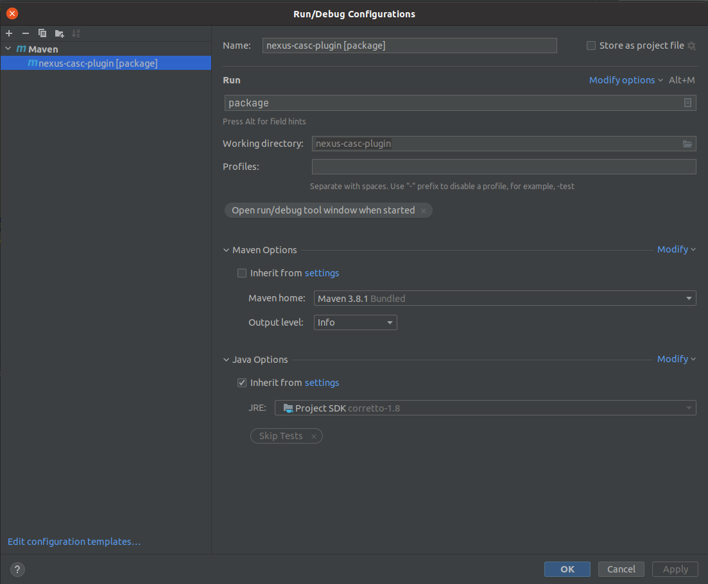

### Image nexus

#### Description
Installed nexus plugin(nexus-casc-plugin) and net-tools package

#### Used nexus image
https://hub.docker.com/r/sonatype/nexus3/

#### Added nexus plugin
https://github.com/AdaptiveConsulting/nexus-casc-plugin

#### Docker login
- `docker login`

#### Build image
- `docker build -t byndyusoft/nexus3:3.65.0 .`

#### Run image
- `docker run --rm -it byndyusoft/nexus3:3.65.0 bash`

#### Push image
- `docker push byndyusoft/nexus3:3.65.0`

#### Docker logout
- `docker logout`

### Setting "IntelliJ IDEA" for build nexus plugin
